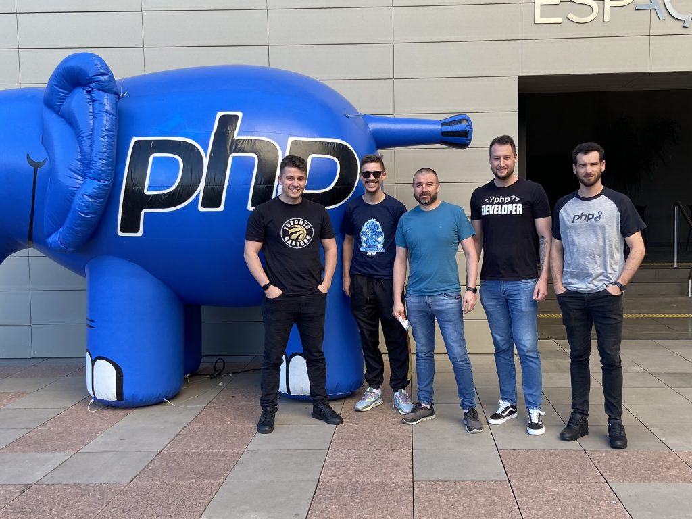
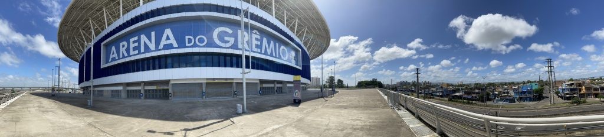
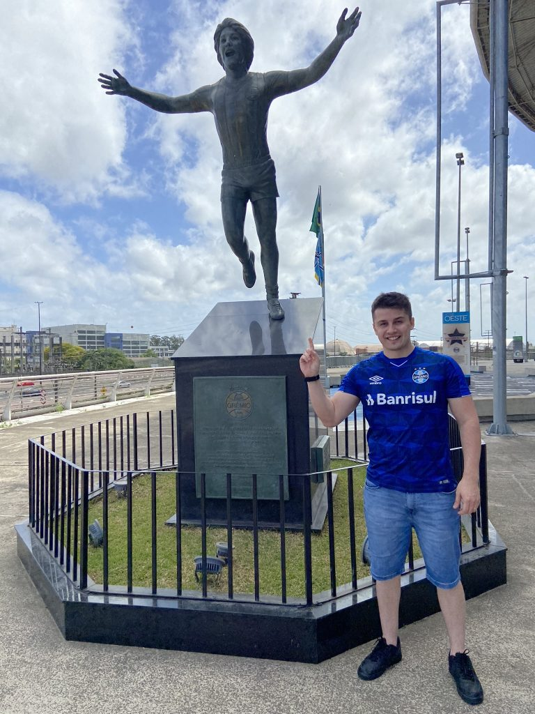

Entre os dias 23 e 27/11, viajei de Chapecó a Porto Alegre para participar da **16ª PHP Conference Brasil**, juntamente com alguns colegas de empresa e com incentivo da [IXCSoft](https://www.ixcsoft.com.br/). O evento aconteceu na Unisinos.

Foi a minha primeira participação neste evento, no qual pude conviver com diversas pessoas que participam ativamente da comunidade PHP no Brasil e que possuem uma influência positiva.

Consegui participar de diversas palestras e principalmente saber um pouco mais da história de alguns desenvolvedores que possuem +20 anos de carreira com PHP, sendo alguns dos desbravadores da linguagem no país.

Também, foi possível conhecer alguns excelentes projetos que executam PHP e descobrir como a comunidade ama o _Laravel_ e outros frameworks atuais. Isso é algo que preciso praticar mais, não sou um usuário de frameworks no dia a dia, porém percebi que o mercado das grandes capitais o adere bastante pela rapidez de entrega.

Uma outra coisa que me chamou bastante atenção foi o engajamento das pessoas com o evento, elas amam o ecossistema e a linguagem PHP! E isso eu compartilho com muito prazer.

Equipe da IXC. Da esquerda para direita: Eu, Matheus, Franklin, Gustavo e André.

Aproveitando a viagem e sendo um amante do Futebol, na volta aproveitamos para conhecer os estádios dos grandes do futebol Gaúcho, e é claro que eu sou torcedor do **Grêmio**.

Estádio do Grêmio.

Estátua do maior ídolo do clube, Renato Gaúcho.

O **evento me incentivou a continuar algo que já faz tempo que idealizo: contribuir mais com a comunidade,** mesmo não sendo um expert da linguagem, sei que posso ajudar as pessoas com alguns conteúdos e pretendo disponibilizar mais tempo para isso.

Recentemente li um artigo do Joe Watkins, o qual diz que para contribuir com a linguagem não é necessário escrever em Linguagem C ou idealizar um framework, é possível contribuir de outras formas como gerando conteúdo, respondendo dúvidas, participando de eventos, traduzindo a documentação e etc, e isso foi umas das motivações para iniciar este blog.

Para finalizar, parabenizo os organizadores do evento por propagar a linguagem e querer manter a linguagem mais viva que nunca!

Só senti falta de encontrar o [ElePHPant](https://www.elephpant.com/) para comprar e levar pra casa rsrs

